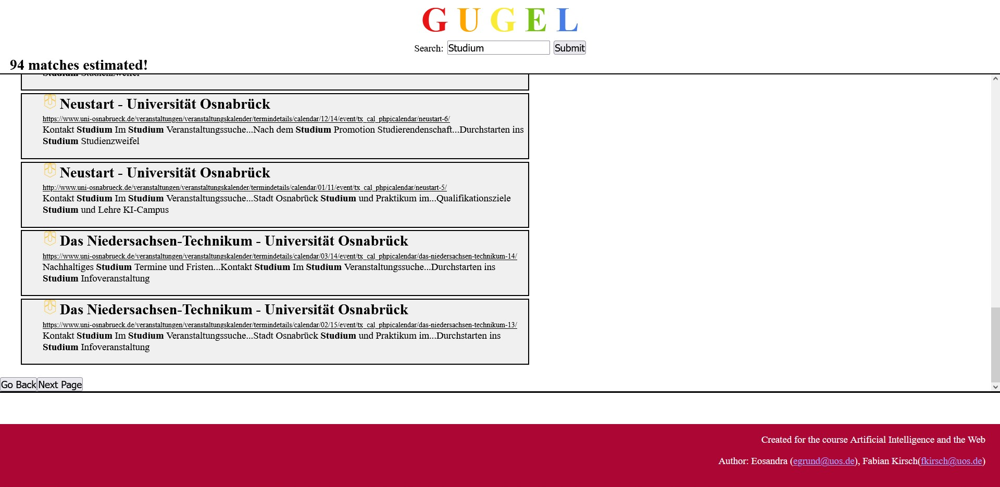
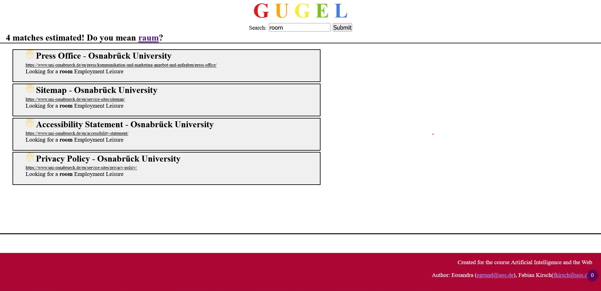

Search Engine by Eosandra Grund and Fabian Kirsch

# Our Search Engine
We created a Search Enginge for the course "Artificial Intelligence and the Web"(WS23/24). It consists of a [crawler](mylib/crawler.py), that can create a whoosh [Index](Index) (it is limited to crawling one server for time reasons), and a flask [app](gugel.py) that runs searches in the [Index](Index) using the class [index.Index](mylib/index.py). We also programmed an [update thread](mylib/updatedaemon.py), that regularly checks which entries are old and replaces them. It also checks whether there are new urls to be found. As the Search Enginge is running on an university server, the update will be started directly with the first request each day, because we could not change the server's task scheduling settings. 

Example screenshot of page 2 of a search for the term "Studium". It shows that there where 94 matches. At the bottom of the results is a go back button to go the first page and a next page button.

Example screenshot of a search for the term "room". It shows that there where 4 matches, and suggests to search for "raum" instead.

## Usage
Use [main_create.py](main_create.py) to create an index by running ```python main_create.py path``` and substituting path for the page you want to use. Make sure there is an entry in [website_dicts.py](website_dicts.py) with ```"path" = path```. 
The index which is used by the flask app is hard coded in [gugel.py](gugel.py), but can be changed easily. 

## Files: 
### Folders:
* [mylib](mylib): Folder with different Plots from runs and tests ???
  * [crawler.py](mylib/crawler.py): The web crawler to gather information from websites and send them to the index
  * [index.py](mylib/index.py): An Index class that controlls all writers and searchers to the whoosh index
  * [myfunctions.py](mylib/myfunctions.py): Contains a function "get_page" to retrieve a webpage using requests, a function "thread_highlights" gets content of a page to create highlights and gets the favicon url and a function for creating a logging object. 
  * [myhighlighter.py](mylib/myhighlighter.py): Contains a class SavingHighlighter, which is a child of whoosh.highlight.Highlighter but can split the hit_highlights function to use the hit object to get all the important information needed to later create highlights only using the content text of the page. 
  * [queuethread.py](mylib/queuethread.py): A daemon that is a priority queue, where all [index.Index](mylib/index.py) object can send requests to and wait until it's there time. 
  * [updatedaemon.py](mylib/updatedaemon.py): A daemon thread that does scheduled updates of the index.
  * [website_dicts.py](mylib/website_dicts.py): A file containing python dictionaries with all changing variables for crawling different websites.
* [Crawler](Crawler): Contains list from the crawler that are saved to reload when the next crawler is created.        
* [Index](Index): Contains the index for different Websites.
* [static](static): contains the static files
  * [images](static/images): folder for saved images
  * [mystyle.css](static/mystyle.css): css file used in html templates	
* [templates](templates): contains the html templates for the search engine

### Files:
* [gugel.py](gugel.py): contains the flask app
* [gugel.wsgi](gugel.wsgi): Wsgi file to run our gugel.py on the server.
* [main_create.py](main_create.py): Creates a crawler and crawls given page to add it into the index.
* [requirements.txt](requirements.txt): list of dependencies for our flask app
* [Examples](Examples): contains pictures for the ReadMe.md